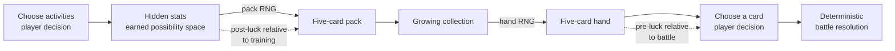

# Lesson 10 — Randomness: packs, hands, and player trust

> Branch `10-PackGeneration` · Previous: `09-StatTriangle`
>
> This is a live **balancing** class, not a live-programming class. The code is
> already an instrument. We use it to form a hypothesis, generate evidence,
> argue about whether the result feels right, change one rule, and repeat.

```sh
love .                         # open the Pack Lab
love . --debug                 # Pack Lab + inspect every plain-data result
luajit tests/generation.lua    # 10,000-card distribution/property test
```

## The lesson in one sentence

> Randomness is not the absence of design. The designer chooses the possibility
> space; randomness chooses one point inside it.

By the end of class, students should be able to:

- distinguish **pre-luck/input randomness** from **post-luck/output randomness**;
- explain what randomness contributes besides mere variety;
- identify which outcomes a generator is allowed to change and which promises
  it must never break;
- test one random outcome, a reproducible outcome, and a distribution;
- separate mathematical fairness from the player's feeling of fairness;
- make and defend a balance change using observations from the Pack Lab.

## Before class

Run the lab once and learn its small vocabulary:

| Key | Action |
|---|---|
| `1` | First Monday: `1 / 1 / 1` |
| `2` | Studied all week: `6 / 1 / 1` |
| `3` | Mature specialist: `20 / 5 / 10` |
| `Left / Right` | Select a stat |
| `Up / Down` | Adjust it by one |
| `PageUp / PageDown` | Adjust it by five |
| `P` | Generate a new five-card pack and add it to the collection |
| `R` | Replay the last pack's seed; unchanged inputs reproduce the pack |
| `H` | Draw five cards from the entire collection, without replacement |
| `C` | Clear the experimental collection and its counters |

The screen shows the expected primary-stat weights at the top, the latest pack,
the hand that play would actually see, the seed, collection size, and observed
primary distribution. The terminal prints the same cards in a form that is easy
to copy into notes.

The balance knobs are intentionally collected in
`src/data/card_rules.lua`:

```lua
return {
    packSize = 5,
    handSize = 5,
    primaryMin = 0.50,
    offStatMax = 0.50,
    weightPower = 1,
}
```

Change only one knob at a time during class. Reload the game, repeat the same
experiment, and ask what experience the changed number created.

---

## Board plan

Draw this before students enter, but leave the labels **post-luck** and
**pre-luck** covered until the class names them.



Under it, reserve three columns:

```text
ONE RESULT                 MANY RESULTS               PLAYER EXPERIENCE
Does it obey the rules?    Does the distribution fit? Does it feel earned?
card bounds                10,000 cards               bad streaks
phrase matches primary     expected vs observed       surprise vs betrayal
same seed + inputs         tolerance, not equality    trust and readability
```

The first two columns can be automated. The third requires people playing the
game—but it should still produce written observations, not just “good” or “bad.”

---

## Run of class (about 100 minutes)

### 0–12 min — The Pokémon question

Put this on screen before defining randomness:

> The same Pokémon uses the same move against the same opponent, under the same
> conditions. Why doesn't the attack always deal exactly the same damage?

Let students propose answers. Keep separate lists for **what the mechanic does**
and **why a designer might want it**.

Useful mechanical distinctions:

- **Accuracy:** after choosing a move, a roll can erase the entire result. This
  is binary, high-impact post-luck.
- **Damage roll:** a successful damaging move normally includes a bounded random
  factor. In modern main-series Pokémon this is commonly an integer from 85 to
  100 percent. The decision succeeds, but the exact result varies.
- **Critical hit:** a successful attack sometimes becomes an unusually positive
  result. It is still post-luck, but its emotional direction differs from a miss.

Ask:

1. What does damage variance add if the player never sees the roll?
2. Does it make a near knockout more exciting, or make planning less honest?
3. Is a 10% chance to miss emotionally equivalent to a 10% chance to crit?
4. Who receives the surprise? Who receives the frustration?
5. Would competitive Pokémon become better, worse, or merely different if all
   legal moves had perfect accuracy and fixed damage?

Possible reasons to test—not facts to simply announce:

- exact damage would make knockout thresholds easier to solve completely;
- bounded variance asks players to plan for a range rather than one number;
- uncertainty creates dramatic survival and knockout stories;
- repeated turns feel less mechanical;
- the cost is weaker feedback: a sound decision can receive a bad result.

The bounded part matters. Pokémon does not replace damage with an arbitrary
number; the combat calculation creates a narrow valid range. This is the same
kind of promise our card generator needs.

#### FFXIV comparison

Older FFXIV gearing included Accuracy and the possibility of routine misses.
Stormblood removed that offensive gear requirement and introduced Direct Hit;
current PvE job descriptions prominently use critical and direct hits, including
abilities that guarantee them. Use this as a design comparison, not a claim that
all misses and crits are mechanically interchangeable:

> What changes when routine uncertainty moves from “your action may do nothing”
> to “your action works, and may become better than expected”?

The average damage can be tuned to the same value while the emotional experience
changes completely. Negative post-luck asks the player to brace for loss;
positive post-luck creates a bonus they should not need in their plan.

### 12–25 min — Why use randomness at all?

Ask students to design the deterministic version first:

```text
Stats 6 / 1 / 1 always produce the same five cards.
```

**Say:**

> Determinism is not the bad version. It is predictable, learnable, testable,
> and fair. So randomness has to earn its place.

Build the case from student answers:

- different runs create different situations from the same authored content;
- players master the underlying system rather than one memorized sequence;
- uncertainty interrupts perfect plans and forces reevaluation;
- rare combinations produce personal stories;
- uncertain rewards make revealing a pack exciting;
- luck can soften a skill gap, useful in social and family games;
- too much luck obscures mastery and makes losses feel undeserved.

Then reveal the sentence at the top of the board: the job is not to “add RNG.”
The job is to define its authority.

### 25–38 min — Pre-luck and post-luck

Use the board timeline.

**Say:**

> Post-luck happens after I decide and tells me what my decision achieved.
> Pre-luck happens before I decide and gives me a situation to respond to.

Classify familiar examples:

| Example | First classification | Important question |
|---|---|---|
| Pokémon move misses | Post-luck | Did luck erase a considered decision? |
| Pokémon damage roll | Post-luck | How wide is the possible consequence? |
| Pokémon critical hit | Post-luck | Is surprise arriving as punishment or bonus? |
| Roguelike map | Pre-luck | Does the player have time and tools to adapt? |
| Card hand drawn before a turn | Pre-luck | Are there several meaningful responses? |
| Loot box after purchase | Post-luck | What decision remains after the reveal? |

Now locate *Small Talk*'s pack:

- Relative to weekday training, the pack is **post-luck**: the player already
  chose Study, Grooming, or Hobbies.
- Relative to the upcoming date, the same pack and later hand are **pre-luck**:
  they create the situation the player must navigate.

**Key point:** these are not permanent labels attached to an object. They name
the position of luck relative to a decision.

### 38–55 min — First feel test: “I studied all week”

1. Press `2` for `6 / 1 / 1`.
2. Before generating, ask every student to privately write what a fair pack
   should look like. Do not let the first confident answer anchor the room.
3. Press `P` once.
4. Ask only for observations at first:
   - How many Intelligence primaries?
   - Did any card exceed the trained stats?
   - Do the phrases sound like their primaries?
   - What surprised you?
5. Only then ask: “Did this feel like the week I played?”
6. Generate four more packs. Do not judge the generator from the favorite one.

With `6 / 1 / 1`, the weights are 75% Intelligence and 12.5% for each other
stat. Five Intelligence cards are perfectly ordinary. Zero Intelligence cards
are legal but occur only about once in 1,024 packs under independent draws.
Five Sense-primary cards are legal but vastly rarer: about once in 32,768 packs.

Use that to ask:

> If an outcome is mathematically legitimate but looks like the game ignored a
> whole week of player choices, should it remain possible?

Do not answer yet. This is the class's balance problem.

### 55–67 min — Read only the policy code

Do not tour every file. Show the lines where design became executable.

#### Weighted primary

```lua
local target = random() * total
local cumulative = 0
for _, name in ipairs(STATS) do
    cumulative = cumulative + weights[name]
    if target < cumulative then return name end
end
```

Draw `20 / 5 / 10` as 35 raffle tickets. This makes a weighted choice tangible
without requiring normalization first.

#### Bounded rolls

```lua
if isPrimary then
    low  = math.ceil(hidden * rules.primaryMin)
    high = math.floor(hidden)
else
    low  = 0
    high = math.floor(hidden * rules.offStatMax)
end
```

Ask students to state the promises as sentences:

- a card never exceeds what was trained;
- its primary is at least half the trained primary stat;
- an off-stat is at most half its trained value;
- randomness changes the result without deleting the player's history.

#### Plain data result

```lua
{
    primary = "sense",
    phrase = "Doesn't this remind you of...",
    stats = { int = 1, charm = 2, sense = 8 },
}
```

This is not an entity and not an object with behavior. It is future save-file
data, inspectable by the debug overlay and usable by several later systems.

### 67–82 min — Pack quality is not hand quality

1. Press `C`, then `1` and generate two packs.
2. Change to preset `2` and generate several specialist packs **without clearing**.
3. Press `H` repeatedly.

Ask:

- Do the new packs reflect the current training?
- Do the hands reflect it as strongly?
- Which old cards keep returning?
- Is that unfair randomness, or collection history doing exactly what we asked?
- When does a growing collection become deck dilution?

The hand draw uses a partial Fisher–Yates shuffle:

```lua
for i = 1, count do
    local picked = random(i, #candidates)
    candidates[i], candidates[picked] = candidates[picked], candidates[i]
    hand[i] = candidates[i]
end
```

It samples without replacement and does not mutate the collection. This is
pre-luck: after seeing the hand, the player will choose how to use it. The draw
should create a problem, not pronounce a verdict.

This experiment also gives the GDD's future deck-builder stretch goal a concrete
reason to exist.

### 82–94 min — Test randomness at three scales

#### A. One output: properties

For every card, assert the non-negotiable promises:

```lua
assert(value <= hidden[name])
assert(primaryValue >= math.ceil(hidden[primary] * primaryMin))
assert(offValue <= math.floor(hidden[offStat] * offStatMax))
```

Do not assert that one random card equals the card you hoped to see.

#### B. One exact replay: seed + inputs

Generate a pack with `P`, photograph or note it, then press `R`.

**Say:**

> The player needs unpredictability. The developer needs reproducibility.
> A pseudorandom generator gives us both: same seed plus same inputs, same result.

Change a stat and replay the seed again. The result may change because a seed is
not the whole state of the experiment. A useful bug report records inputs,
rules, code version, and seed.

#### C. Many outputs: distribution

Run:

```sh
luajit tests/generation.lua
```

The test generates 10,000 cards from `20 / 5 / 10`, checks every card's bounds,
and compares observed primary frequencies with expected weights using a
tolerance. It does **not** demand exact percentages: a random sample that must
match exactly is no longer behaving randomly.

Finish with the missing fourth test:

> A population can be statistically correct and still contain miserable player
> experiences. Which streaks should we measure next?

Candidates: packs with no strongest-stat card, consecutive disappointing packs,
weakest possible hand, or the time until each stat appears.

### 94–100 min — Live balance vote and exit ticket

Choose one proposed change:

- raise `primaryMin` so every primary card feels more valuable;
- lower `offStatMax` so card identities become cleaner;
- raise `weightPower` to reward specialization more aggressively;
- guarantee one strongest-stat primary per pack;
- replace independent draws with a bag that limits streaks.

Change one rule, reload, and repeat the `6 / 1 / 1` experiment. Ask whether the
change fixed the stated problem and what new behavior it created.

Exit ticket:

1. Name one piece of luck in a game you like.
2. Is it pre-luck or post-luck relative to the player's closest decision?
3. What promise prevents it from feeling arbitrary?
4. How would you test that promise?

---

## Optional extension (12–15 min) — Prospect Theory, pity, and gacha

Use this only if the core lesson finishes early. Otherwise, it is a strong
opening for the next class: generated card art and pack-opening presentation
will make the *same probabilities* feel more or less valuable.

For the short version, keep a hard cut:

```text
2 min  Pokémon miss versus crit: same expected value, different feeling
4 min  reference point, loss aversion, probability weighting
5 min  gacha: independent rolls versus hard/soft pity
3 min  apply one protection to Small Talk
1 min  ethical exit question
```

If discussion becomes lively, stop after Prospect Theory and carry the gacha
case study into the next lesson rather than rushing the ethics.

### The bridge

Return to the Pokémon question:

> Suppose two systems have the same average damage. In one, attacks sometimes
> miss and sometimes hit very hard. In the other, attacks always work and
> occasionally crit. Are those systems emotionally equivalent?

They are not necessarily equivalent because players do not experience outcomes
as neutral changes to a total. They compare them with a **reference point**:
what they owned, expected, were promised, or felt they had already earned.

Kahneman and Tversky's 1979 Prospect Theory describes decisions in terms of
gains and losses relative to such a reference point. Its characteristic value
function is:

- concave for gains: each additional gain often adds less subjective value;
- convex for losses: sensitivity to additional losses also diminishes;
- steeper on the loss side: an equivalent loss commonly matters more than a gain;
- paired with **decision weights**: people do not treat probabilities as their
  raw mathematical values, especially near certainty and at very small chances.

Draw this approximate shape—do not put exact units on the vertical axis:

```text
                       subjective value
                              ▲
                         gain ╭────
                             ╱
────────────── loss ────────●──────────────▶ outcome
                    ____╯    reference point
                ___╯
                steeper
```

**Say:**

> This is a descriptive model of how choices often behave, not a commandment
> that every person values every loss identically.

### Be precise about “losses hurt twice as much”

The popular `2×` phrase is a useful memory aid, but not a universal psychological
constant. A later 1992 cumulative-prospect-theory fit estimated a loss-aversion
coefficient of about `2.25` for its particular experiments and model. Other
contexts and studies produce other estimates.

Therefore, avoid presenting this as a game-design law:

```text
BAD RULE:  Every 50/50 gamble needs exactly a 2:1 reward.
BETTER:    An equal mathematical exchange may not be an equal felt exchange.
TEST:      What is the reference point, and what does the player call a loss?
```

A player might frame a missed attack as losing a turn, a pity counter as owned
progress, or an ordinary pack as a loss after seeing a spectacular animation.
Framing can change while the arithmetic remains fixed.

### Probability weighting is not the gambler's fallacy

Keep these ideas separate:

- **Probability weighting:** small probabilities can receive disproportionate
  attention, while “very likely” can be experienced as practically certain.
- **Gambler's fallacy:** after a streak, a person incorrectly expects an
  independent opposite result to be “due.” Five failed independent rolls do not
  alter the sixth roll's probability.
- **Pity system:** the game deliberately makes the rolls *not independent* by
  changing future probabilities or guaranteeing an outcome. With pity, the
  player's belief that later odds improved may be correct.

This distinction is a useful programming question:

> Is the history only in the player's head, or is history an input to the RNG?

### Gacha case study: facts, inference, and design hypothesis

Use Genshin Impact because many students will recognize it, but divide the board
into three levels of confidence.

#### Published or directly observable

- Character-event wishes publish a low base five-star rate and a hard guarantee
  by a maximum number of wishes; the exact rules should always be checked on the
  current in-game banner details.
- A five-star resets the relevant pity count.
- The system makes history part of future outcomes, unlike independent dice.

#### Empirically inferred by players

- Large community datasets show a sharp rise in five-star frequency around the
  mid-70s for character-event wishes, commonly called **soft pity**.
- The exact per-pull curve is not clearly published as a complete formula, so
  values such as “about +6 percentage points per pull starting at 74” should be
  labeled as reverse-engineered estimates, not official constants.

#### Plausible design hypotheses—not proven intent

- A guarantee limits the worst possible losing streak and therefore the maximum
  frustration and cost for one success.
- Visible or learned progress changes the reference point: at high pity, players
  may feel they are “close” and that stopping would abandon accumulated progress.
- Soft pity can make the approach to the guarantee feel increasingly hopeful
  instead of like an unchanging sequence of failures.
- It may reduce player drop-off, but without internal telemetry or designer
  testimony, claiming a specific threshold was chosen from a measured “churn
  cliff” goes beyond the public evidence.

### Do the no-pity math, then explain why it is incomplete

For an imaginary independent gacha with a flat `p = 0.006` chance:

```text
Mean waiting time:       1 / p ≈ 166.7 pulls
No success after n:      (1 - p)^n
Success by pull 73:      1 - 0.994^73 ≈ 35.5%
Still waiting after 73:  0.994^73 ≈ 64.5%
```

This calculation explains a flat independent system. It does **not** by itself
prove why a real game's pity curve begins at any particular pull. Once rates
change with history, the flat geometric model no longer describes the full
system.

Ask:

1. Does hard pity make a gacha fair, or only bounded?
2. Is a guarantee generous if the price required to reach it is very high?
3. Should pity progress be prominently visible? How does visibility change the
   player's reference point?
4. When does protection from bad luck become encouragement to keep spending?
5. What responsibilities change when purchases use obscured currencies or when
   children can play?
6. Could we obtain the useful design effect—bounded streaks—without monetizing
   the player's frustration?

### Bring it back to *Small Talk*

Our packs cost in-game time, not money, but the emotional principle still
applies. After five Study choices, the player may treat “an Intelligence-heavy
pack” as the reference point. A legal all-Sense pack can therefore feel like a
loss, even though the collection only increased.

Possible protections to debate:

- guarantee one primary from the strongest trained stat;
- use a stat-token bag so droughts have a maximum length;
- add a reroll earned through play;
- show weights honestly so the player can form a better reference point;
- let a disappointing card become crafting currency;
- preserve true randomness and accept rare painful stories as part of the game.

End on the ethical and practical design question:

> Are we using psychology to help the game communicate fairly with the player,
> or to make it harder for the player to stop?

That question separates a pity system used to protect play from one used to
protect monetization.

---

## Instructor notes: likely discussion traps

### “Input randomness is good; output randomness is bad”

The distinction is diagnostic, not a moral ranking. Poor pre-luck can decide a
run before the player acts. Carefully bounded post-luck can teach risk management
or create a welcome surprise. Always ask about magnitude, frequency, visibility,
and opportunities to respond.

### “A 75% chance means four of every five cards”

Not in every pack. It means that proportion over a sufficiently large sample.
Human intuition expects random sequences to alternate more evenly than real
independent samples do, so streaks feel suspicious.

### “If it is statistically correct, it is balanced”

Statistics describe the generator. Balance describes the experience created by
the generator inside the rest of the game. A 0.1% betrayal may be acceptable in
a ten-second round and intolerable after an hour of preparation.

### “The seed makes it deterministic, so it is not random”

The sequence is deterministic to a developer who knows the seed and algorithm;
it remains unpredictable to a player who does not. Games normally need
pseudorandomness, not philosophical or cryptographic true randomness.

## Architecture underneath the lab

The scene deliberately follows the repository's atomic-system principle:

```text
PackLabInputSystem      keys -> request events
StatTuningSystem        stat events -> RunState.stats
PackGenerationSystem   pack request -> cards -> collection
HandGenerationSystem   hand request -> sample of collection
PackLabRenderSystem     reads data -> analysis screen
```

The mathematical transformations are not systems:

```text
CardGenerator           stats -> card / pack
HandGenerator           collection -> hand
```

They require no scene, registry, entities, or graphics, so the command-line test
can run 10,000 generations without opening LÖVE. The systems are only adapters
between those transformations and the game world.

## Homework

Watch Game Maker's Toolkit, [The Two Types of Random in Game Design](https://www.youtube.com/watch?v=dwI5b-wRLic).
While watching, find one example that complicates something said in class.

Optional references:

- [Kahneman & Tversky (1979), *Prospect Theory: An Analysis of Decision under Risk*](https://www.ucl.ac.uk/anaesthesia/sites/anaesthesia/files/kahneman-tversky.pdf)
- [Tversky & Kahneman (1992), *Advances in Prospect Theory*](https://psych.fullerton.edu/mbirnbaum/teaching/psych466/articles/Tversky_Kahneman_JRU_92.pdf)
- [HoYoverse: official Wish rules](https://support.hoyoverse.com/hc/en-us/articles/50333906347929-What-are-the-rules-for-making-a-Wish)
- [Community soft-pity analysis](https://github.com/charliedilorenzo/GenshinWishStats), useful precisely because it states its uncertainty
- [Pokémon damage formula and bounded random factor](https://bulbapedia.bulbagarden.net/wiki/Damage_formula)
- [Official Pokémon battling guide: critical-hit manipulation](https://diamondpearl.pokemon.com/en-us/trainersguide/fundamentals/battling/)
- [FFXIV current job guide](https://na.finalfantasyxiv.com/jobguide/warrior/), with guaranteed critical/direct-hit actions
- [FFXIV Stormblood-era Accuracy/Direct Hit discussion](https://na.finalfantasyxiv.com/lodestone/amp/character/12721870/blog/2869931)

## Next class

Generated card art: the same card becomes the same picture. The seed returns,
but this time reproducibility is not only a testing tool—it is the card's visual
identity.
